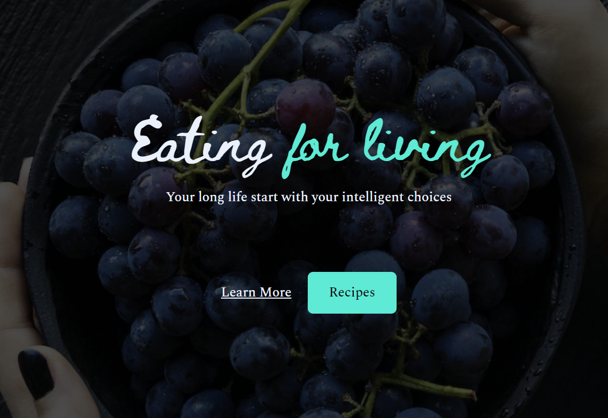

<h1 align="center"> Health Recipes </h1>

O desafio Health Recipes foi desenvolvido durante o evento "Jornada Primeira Vaga" da Rocketseat. O desafio em questão tem por objetivo desenvolver uma Landing Page de uma empresa de receitas saudáveis.  

  

## 🚀 Tecnologias

Esse projeto foi desenvolvido com as seguintes tecnologias:

- HTML e CSS
- Git e Github
- Figma

[Acesse o projeto finalizado, online](https://marcelgava.github.io/jornada-desafio01-health-recipes)
